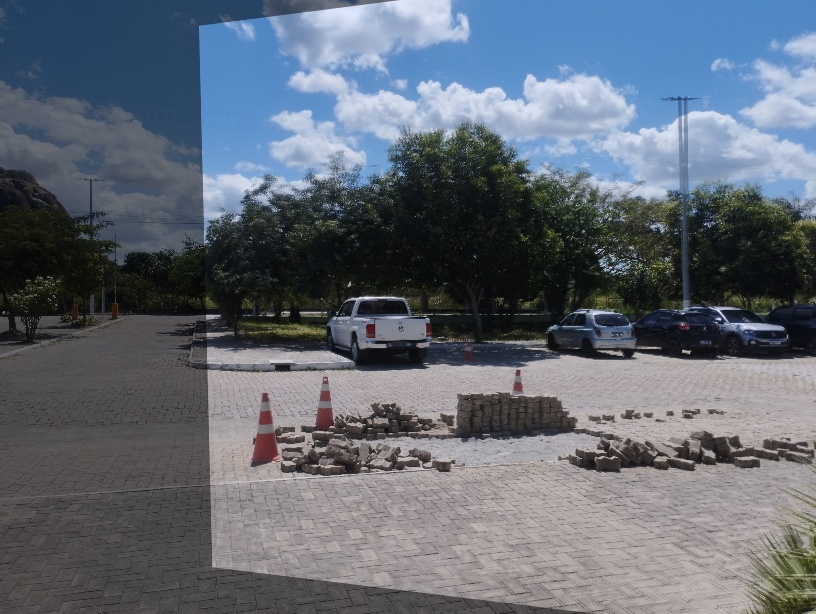
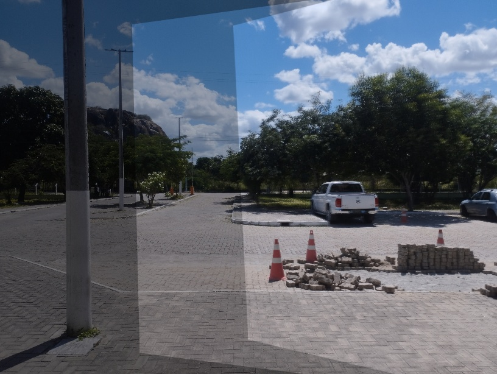
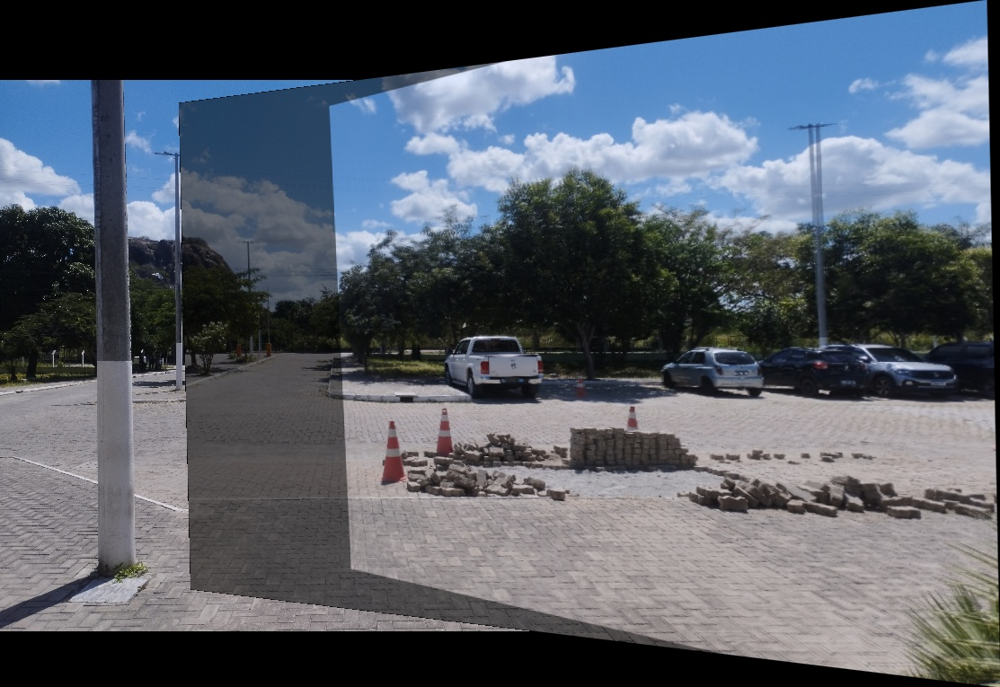
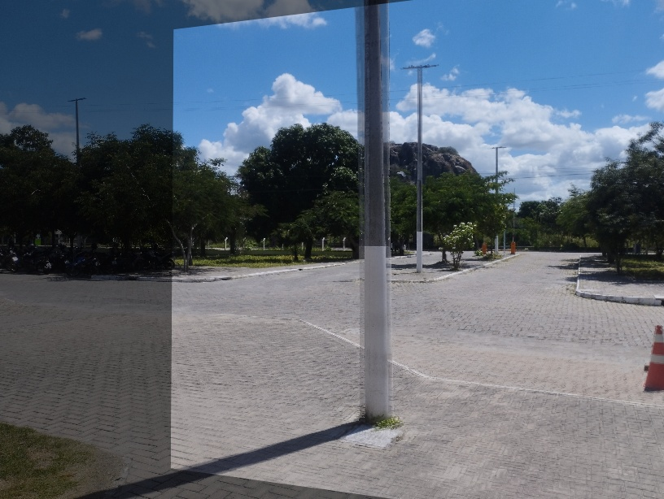
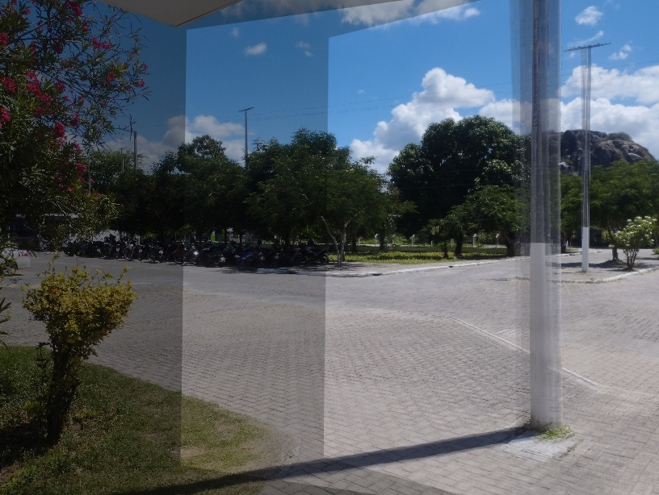
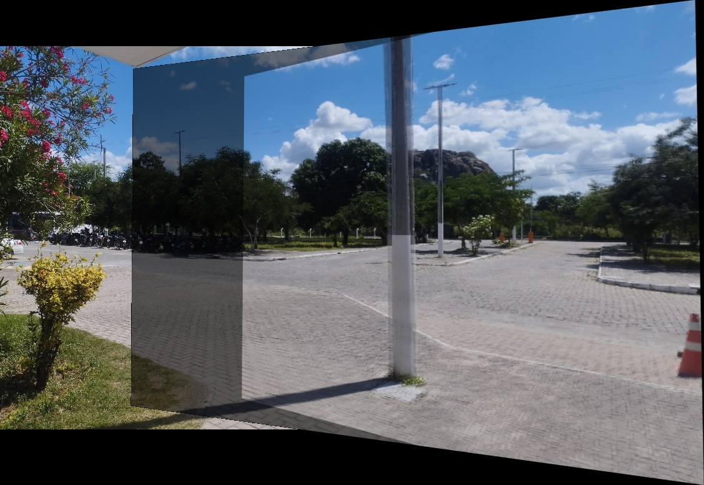
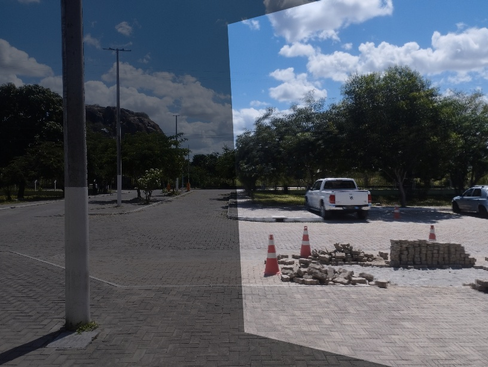
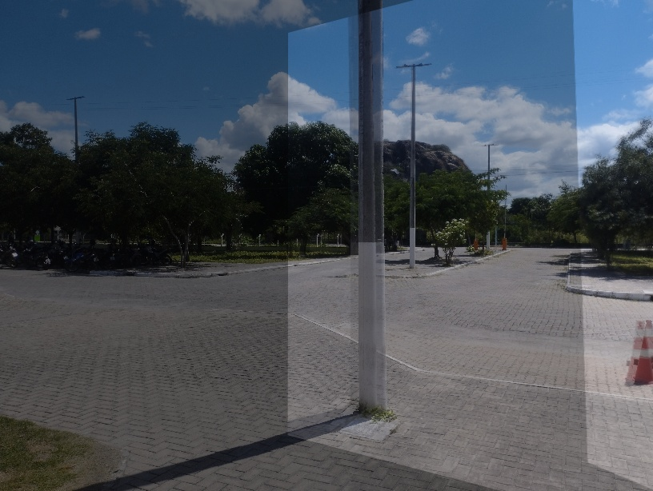
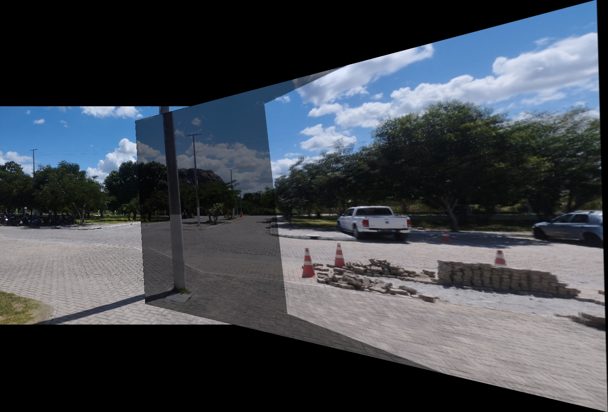

<h1>
    

        Atividade Homografia com 3 imagens
    

</h1>

### Questão: Usando com obase o [código](./homography_Or.py) fornecido, aplique o processo de homografia usando 3 imagens para montar um panorama.

## Resposta:

O código original fornecido faz homografia com 2 imagens, para mudar o código para aceitar 3 apenas foi necessario adicionar uma terceira imagem que seria passada, fazer o processamento da imagem e na hora de fazer a homografia, passar duas imagens por vez.  

O código foi alterado para fazer a homografia das duas primeiras imagens e depois fazer a homografia do resultado das duas primeiras com a terceira imagem, dessa forma o código [homography.py](./homography.py) foi feito com essa alteração.  

Primeiramente tinha pensado em fazer em uma função que passa as imagens e faz a homografia, mas depois resolvi deixar sem função para ficar mais visivel o processo de homografia com as 3 imagens.  

## Imagens Utilizadas:
Foram utilizadas as seguintes imagens para testar o código:  

  
  
  
  
  
  

## Primeiro Teste:
O primeiro teste foi feito com as imagens as 3 primeiras imagens, onde ele teve o seguinte resultado:

Após a homografia das duas primeiras imagens:

    

Após a homografia das tres imagens:

    

O output final ficou como:

    

## Segundo Teste:
O segundo teste foi feito utilizando as 3 ultimas imagens, onde foi gerado:

Após a homografia das duas primeiras imagens:

    

Após a homografia das tres imagens:

    

O output final ficou como:

    

## Teste Final:
Para o ultimo teste, decidi pegar algumas imagens mais distantes para ver ver oque iria sair, pegando a primeira imagem, a terceira e a quinta, teve como resultado o seguinte:

Após a homografia das duas primeiras imagens:

    

Após a homografia das tres imagens:

    

O output final ficou como:

    

Ecerrando assim essa questão.
