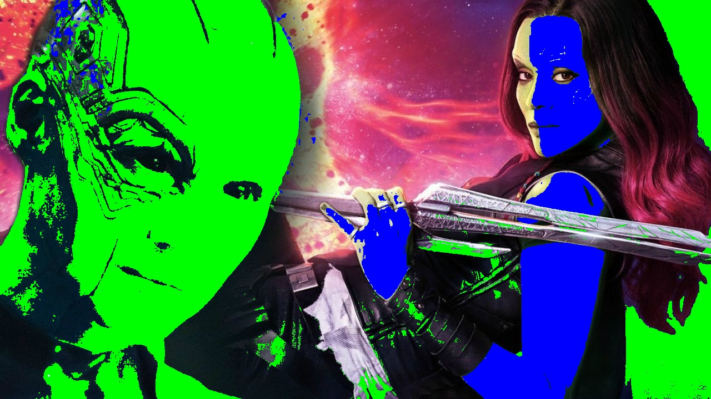

<h1>
    

        LAB 01
    

</h1>

### Questão: Trocar a cor de pele das personagens na imagem [gamora_nebula.jpg](./gamora_nebula.jpg). As demais partes da imagem devem permanecer inalteradas.

## Resposta:
Para resolver a questão, dei uma mudado na código, não estava sabendo como mudaria completamente tudo de forma correta, a pele verde até que foi, mas a azul tive muitos problemas para acertar, então no final ficou dessa forma o resultado:

  

