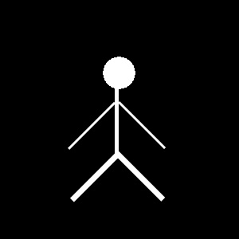

<h1>
    

        LAB 02
    

</h1>

### Questão 1: Deixar a imagem do arquivo ['jato.jpg'](./imagens/jato.jpg) mais amarelada usando transformação gamma.
### Questão 2: Utilizando como base as figuras [‘circle.jpg’](./imagens/circle.jpg) e [‘line.jpg’](./imagens/line.jpg), forme o desenho de um “boneco palito” aplicando uma sequência de transformações geométricas e operações lógicas nas imagens, seguindo as regras abaixo.
#### - A figura resultante deve ter um tamanho de 300x300.
#### - Use cópias da figura ‘line.jpg’ para os braços, pernas e tronco do boneco.
#### – Não redimensione as imagens para criar o tronco e a cabeça.
#### – Cada braço deve ter 75% do tamanho do tronco.
#### – As pernas devem estar em um ângulo de 90º entre si e devem ter o dobro do tamanho dos braços.
#### – Posicione o boneco no centro da imagem.

OBS: Se por alguma razão as imagens não aparecerem, aperte nesse [link](https://drive.google.com/drive/folders/1t62Uqgc9Q7QldWF5BaO89yR8VkdF34_d?usp=drive_link) para ver as imagens pelo Drive.

## Resposta:
Questão 01: para resolver o problema, criei o código [lab2_a.py](./lab2_a.py), onde fiz a transformação gamma, fazendo a imagem ficar assim:

  

Questão 02: Nessa questão, criei o arquivo [lab2_b.py](./lab2_b.py) com o código de resolução. Serei sincero e direi que utilizei o Gepeto para me ajudar a criar o código, eu estava falhando muito e com muitos problemas para concluir ela, por isso utilizei ele. Com o código feito e ajustado, o boneco ficou assim:

  

