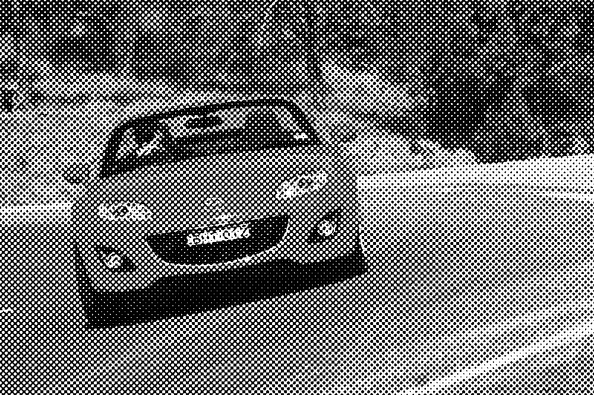
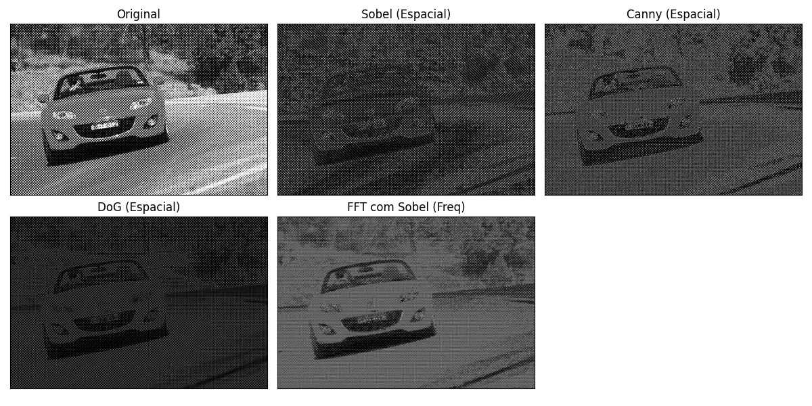
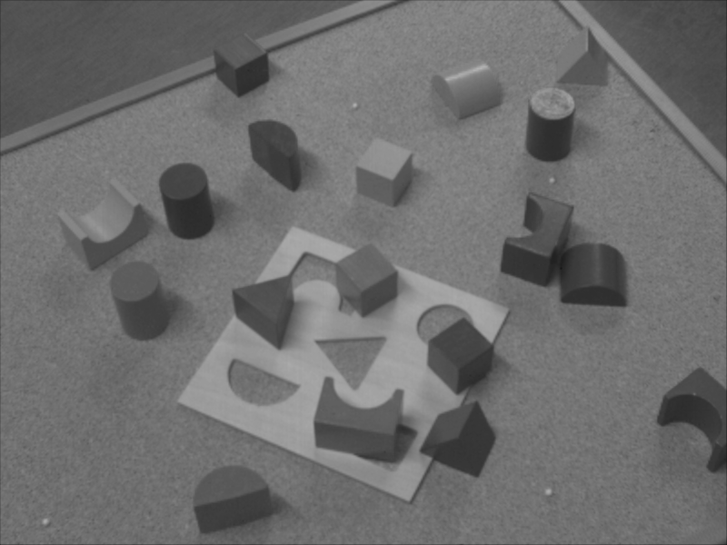
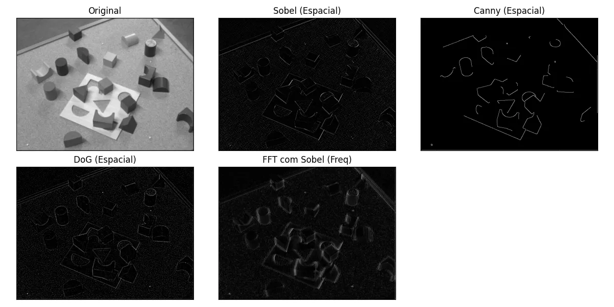
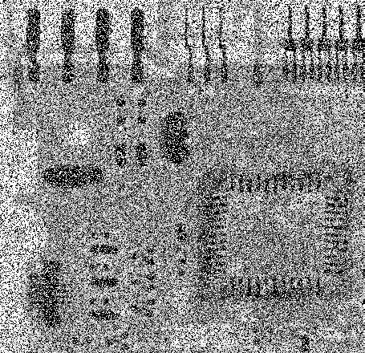
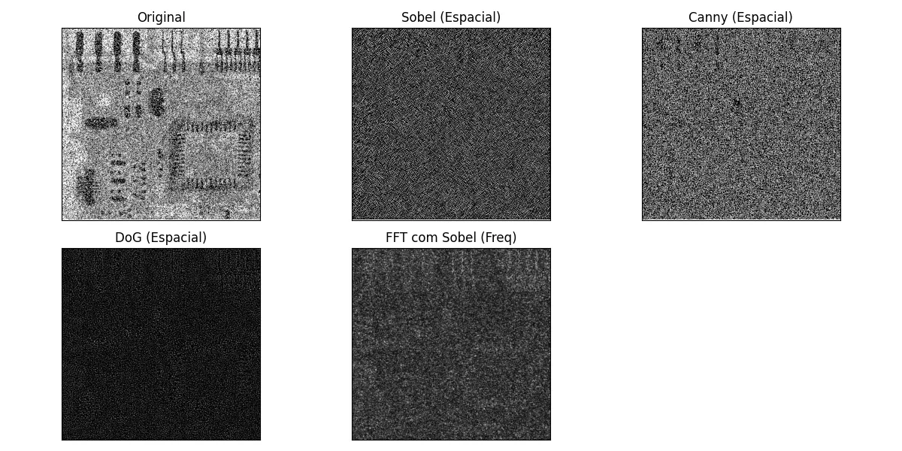

<h1>
    

        LAB 03
    

</h1>

### Questão 1: Para cada uma das [imagens](./imagens) fornecidas:
#### • Analise e aplique filtros tanto no domínio do espaço quanto da frequência, de forma a remover (ou reduzir) o ruído presente nas imagens.
#### • Compare e explique os resultados, descrevendo o raciocínio que o levou usar cada um dos filtros aplicados.
### Questão 2: Escolha uma imagem qualquer colorida e aplique um ou mais filtros convolucionais, deforma a resultar em uma imagem em tons de cinza. Considere a fórmula abaixo, onde Y é o valor do pixel em tons de cinza e R, G e B correspondem aos valores dos pixels nos canais Vermelho, Verde e Azul, respectivamente. Y=(0,3×R)+(0,59×G)+(0,11×B)
### Questão 3: Repita a questão anterior, mas dessa vez a imagem resultante deve ter uma coloração sépia. 

OBS: Se por alguma razão as imagens não estiverem aparecendo, acesse o link do drive com imagens [aqui](https://drive.google.com/drive/folders/1OQvIinhRtFebyAun28HdDz42JbYG9954?usp=drive_link).

## Resposta:

Questão 01: O código para fazer o resultado está em [lab3_1.py](./lab3_1.py), sendo sincero, não sei se era realmente oque queria, mas pelo menos tentei fazer algo, foi uma questão que fiquei meio perdido de como fazer, pedi até ajuda do Gepeto para tentar entender como resolver essa.

Sobre os resultados das imagens, elas ficaram assim:

  

    ==   RESULTADO   ==

  

  

    ==   RESULTADO   ==

  

  

    ==   RESULTADO   ==

  

Questão 02: A resposta da questão 2 está em [lab3_2.py](./lab3_2.py).
A primeira imagem da Oguri Cap é a original, a segunda é a com os filtros aplicados:

  

  ==   Oguri Cap em tom cinza   ==

  

Questão 03: A resposta está em [lab3_3.py](./lab3_3.py), repetindo a mesma imagem da questão anterior da Oguri Cap, temos o resultado:

  

  ==   Oguri Cap em tom sépia   ==

  

