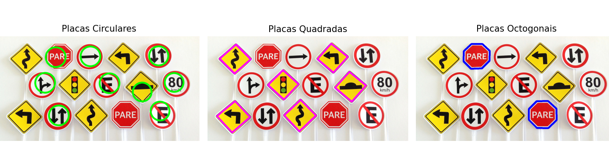
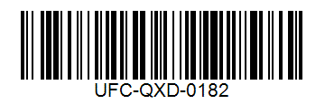
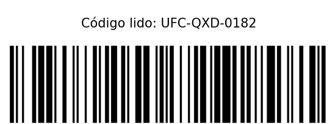

<h1>
    

        LAB 04
    

</h1>

### Questão 1: Considere a imagem ['placas-transito.jpg'](./imagens/placas-transito.jpg) aplique a transformada de Hough para linhas e círculos (verifique a documentação do OpenCV) de modo a localizar as placas presentes nas imagens. Produza uma imagem diferente para cada um dos três modelos de placa.
### Questão 2: Utilizando a transformada de Hough para detecção de linhas, elabore um programa para leitura do código de barras presente na imagem ['barcode-code-128.png'](./imagens/barcode-code-128.png).
#### - O código utiliza o formato CODE-128.

OBS: Se por alguma razão, as imagens não estiverem aparecendo, veja elas [aqui](https://drive.google.com/drive/folders/15scU5jxGD8NqT3RIeKIKsHCwONrkah6h?usp=drive_link)

## Resposta:

Questão 01: Para a questão, foi feito o código [lab4_1.py](./lab4_1.py) utilizando como base o código [hough.py](./hough.py), tendo como imagem original:

  

Resultando na imagem:

  

As placas em circulos detectou quase tudo corretamente, mas fez 2 erros em 2 placas que não eram circulares, é possivel ver com o contorno em verde nas placas. As placas quadradas foram todas corretamente identificadas, é possivel ver isso com os contronos rosa/roxo na imagem. As placas octagonais tambem foram bem identificadas, como é possivel ver com o contorno azul.  

Questão 02: Foi feito o código [lab4_2.py](./lab4_2.py) para a leitura do código de barras da seguinte imagem:

  

Utilizando o código, foi possivel gerar  a imagem:

  

Lembro de na sala o professor ter dito alo sobre não utilizar bibliotecas prontas, igual a que utilizei do Pysbar nesse código, mas sendo sincero, não consegui resolver essa questão sem isso, todas as minhas outras tentativas deram erro, por isso, acabei utilizando a biblioteca.