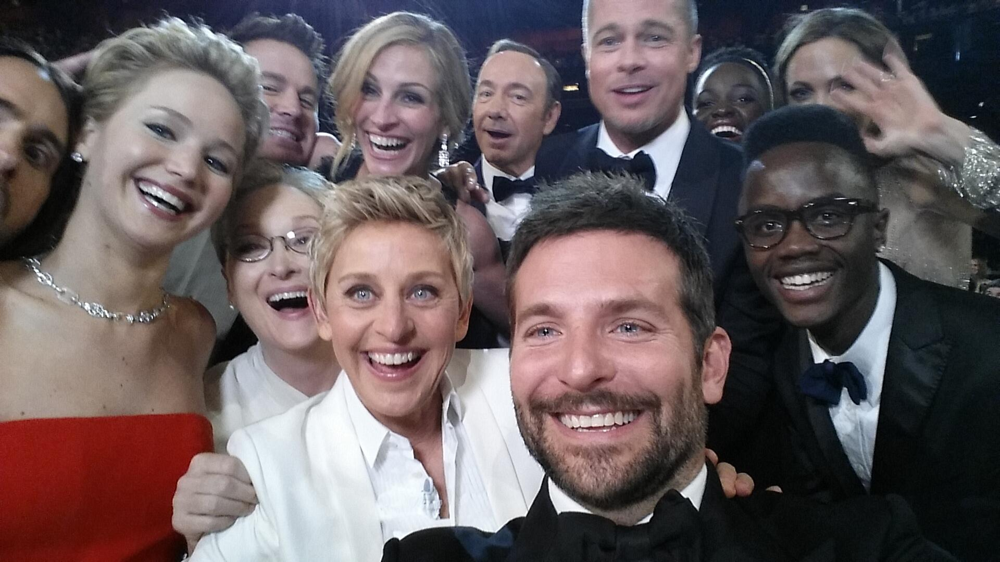
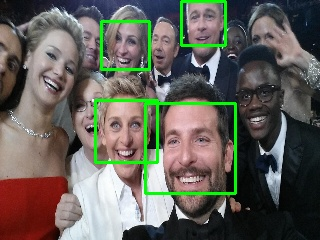
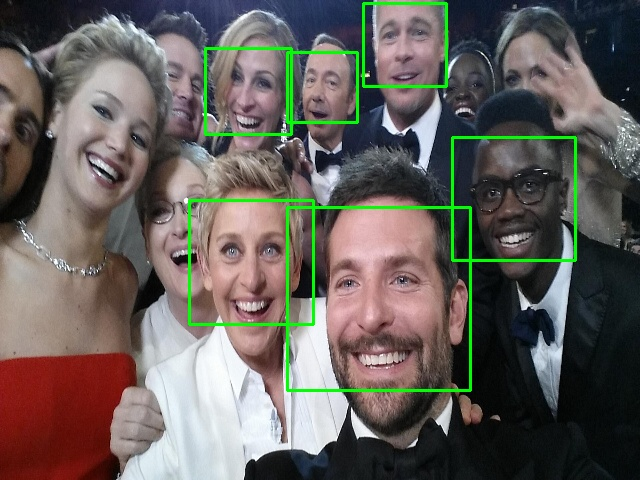
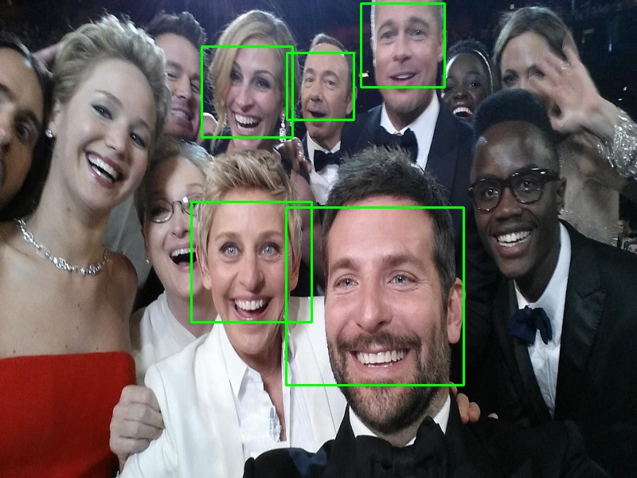
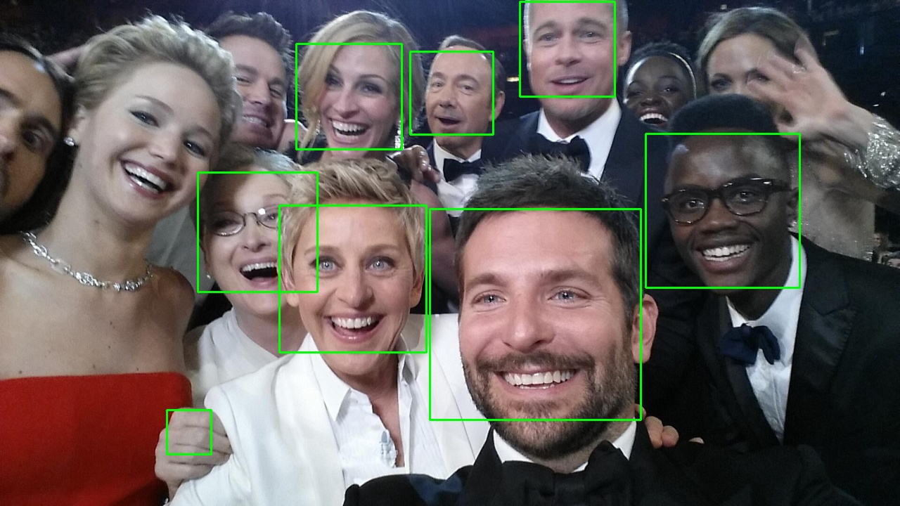
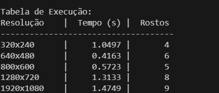
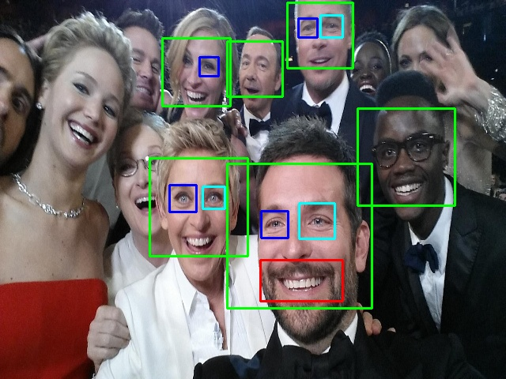
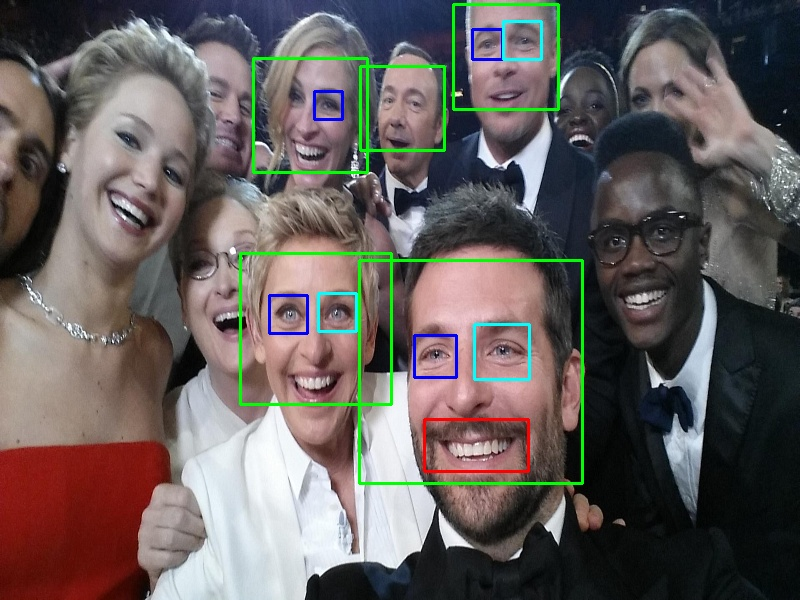
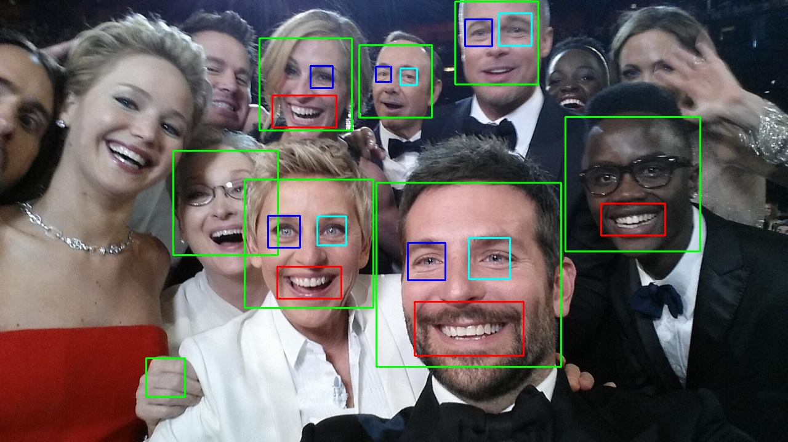
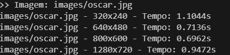

<h1>
    

        LAB 07
    

</h1>

### Questão 1: Usando o classificador HaarCascade, crie um programa que realize a detecção de rosto utilizando vídeo. Teste com imagens de diferentes resoluções e crie uma tabela com os tempos de execução em cada caso.
### Questão 2: Repita a questão anterior mas detecte também a boca e os olhos, diferenciando entre olho direito e olho esquerdo.
#### – Em ambas as questões inclua imagens de rostos com as seguintes características:
#### a: Vistos frontal e lateralmente;
#### b: Utilizando acessórios (chapéu, óculos, máscaras, etc);
#### c: Com e Sem barba, cabelos curtos/compridos/sem cabelo;
#### d: De pessoas de diferentes etnias.

## Resposta:

Questão 1: Foi feito o código [lab7_1.py](./lab7_1.py) para resolver a questão. Ela teve como imput a imagem:

  

E ela resultou como imagens o seguinte, indo da menor para a maior respectivamente:

  
  
  
  
  

E essa é a tabela de execução:

  

Questão 02:

Da questão 2, foi feito o código [lab7_2.py](./lab7_2.py) que gerava os seguintes resultados:

  
  
  
  

Com os seguintes tempos:

  

