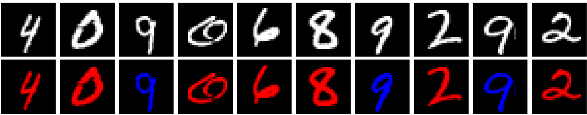

<h1>
    

        LAB 08
    

</h1>

### Questão 1: Com base nos códigos de exemplo fornecidos, crie e treine um autoencoder que recebe uma imagem do dataset MNIST e produz uma imagem colorida com o seu respectivo número em vermelho (se for par) ou em azul (se for ímpar)

## Resposta:

Questão: Essa daqui foi com 100% de ajuda do Gepeto, ele me gerou [esse código](https://colab.research.google.com/drive/1wvHA4VJV2vxuyV8tu0TzNfJBvdcKI680?usp=sharing) do colab, meu notebook não aguentou rodar o código, que tem os seguintes resultados:

  

O código demorou tanto pra rodar, que quando rodou, ele mostrou apenas essas duas primeiras linhas e depois deu erro pelo colab ter desconectado. 